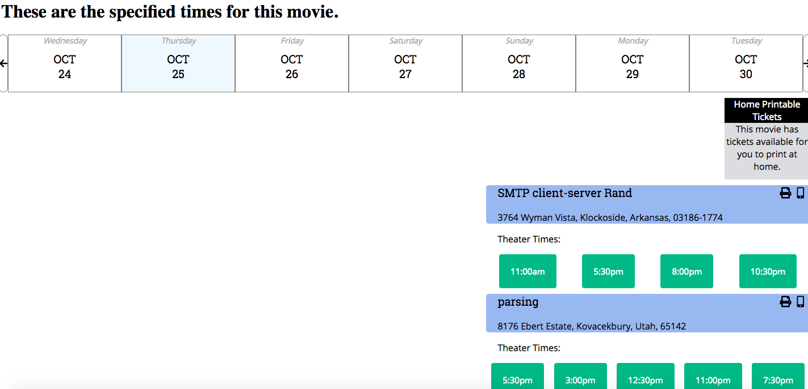

# Project Name

> Calendar, Modal & Theater listing for Moovi's Theatre View component.

# Team Name
> TicketHogger

## Name
> Rao Guttula

## Related Projects

  - https://github.com/Team-DAD/movie-summary
  - https://github.com/Team-DAD/movie-dada
  - https://github.com/Team-DAD/movie-reviews

## Requirements

An `nvmrc` file is included if using [nvm](https://github.com/creationix/nvm).

- Node 6.13.0
- etc

### Installing Dependencies

From within the root directory:

```sh
npm install -g webpack
npm install
```



### SDC updates from Rao Guttula

## Operationalize app 

- npm install

For Database:
- Use below command if you have password for mysql:
	- mysql -u 'input your password' -p

 	otherwise use following to start mysql command line (to verify db, table and seed data):
 	- mysql -u root  
- create database and seed: (seed data is in schema.sql itself)
  mysql -u root < schema.sql

OR
- npm run seed

Build and start the app:
- npm run watch
- npm run server

# CRUD Server Side Documentation


|Action | Request| Route | Purpose|
|-------|--------|-------|--------|
|Create | Post  | /api/moviesbyid/:movieid/:date/:location | Insert new movie record|
|ReadOne| GET   | /api/moviesbyid | Get one movie|
|Update | PUT    | /api/moviesbyid/:movieid/:date/:location | Update movietimes with new movie|
|Delete | DELETE | //api/moviesbyid/:movieid | Delete movie from movietimes|

## POST (Create) REQUESTS:
- req.body requirements: [movie, theater, address, date, latitude, longitude, times]
- Response: [None]

## GET (ReadAll) REQUESTS:
- req.body requirements: [None]
- Response: movie data


## PATCH (Update) REQUESTS:
- req.body requirements: [id, movie, theater, address, date, latitude, longitude, times]
- Response: [None]

## DELETE (Delete) REQUESTS:
- req.body requirements: [id]
- Response: [None]